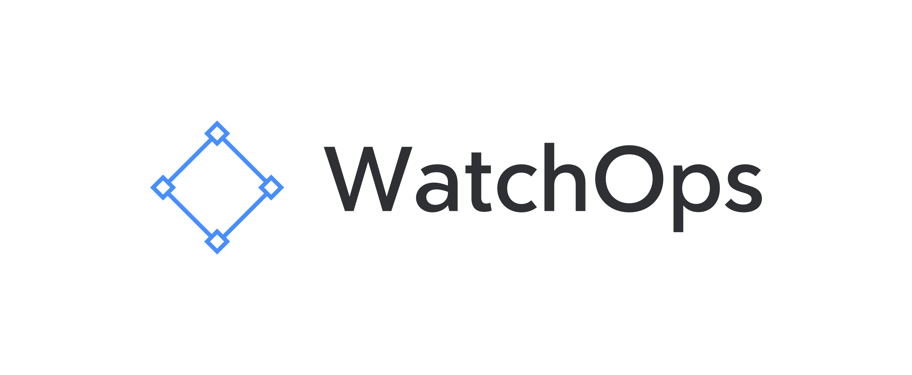

# WatchOps




Implement the [four key](https://cloud.google.com/blog/products/devops-sre/using-the-four-keys-to-measure-your-devops-performance) metrics in your organization. These metrics help you better understand how your teams are performing when it comes to DevOps practices. Google introduced the four keys metrics in the Accelerator book and the DevOps Research and Assessment (DORA), used as the industry standard for high-performing teams.

I created this project to turn four keys into a more accessible and easier to use application. Currently, you can only use the [open source project](https://github.com/GoogleCloudPlatform/fourkeys) provided by Google in GoogleCloud, kind of out-of-the-box.

You can use WatchOps on any platform. It's even easier to get started if you use Kubernetes, no matter where (EKS, GCP, Azure, or self-hosted).

## Installation

### Helm

[Helm](https://helm.sh) must be installed to use the charts. Please refer to Helm's [documentation](https://helm.sh/docs) to get started.

Once Helm is set up properly, add the repo as follows:

```console
$ helm repo add watchops https://italolelis.github.io/watchops
$ helm repo update
$ helm install my-release watchops/watchops
```

## About the project

Through six years of research, the [DevOps Research and Assessment (DORA)](https://cloud.google.com/blog/products/devops-sre/the-2019-accelerate-state-of-devops-elite-performance-productivity-and-scaling) team has identified four key metrics that indicate the performance of a software development team: 

* **Deployment Frequency**—How often an organization successfully releases to production
* **Lead Time for Changes**—The amount of time it takes a commit to get into production
* **Change Failure Rate**—The percentage of deployments causing a failure in production
* **Time to Restore Service**—How long it takes an organization to recover from a failure in production

## Contributing

Pull requests are welcome. For major changes, please open an issue first to discuss what you would like to change.

Please make sure to update tests as appropriate.

## License
[MIT](https://choosealicense.com/licenses/mit/)
